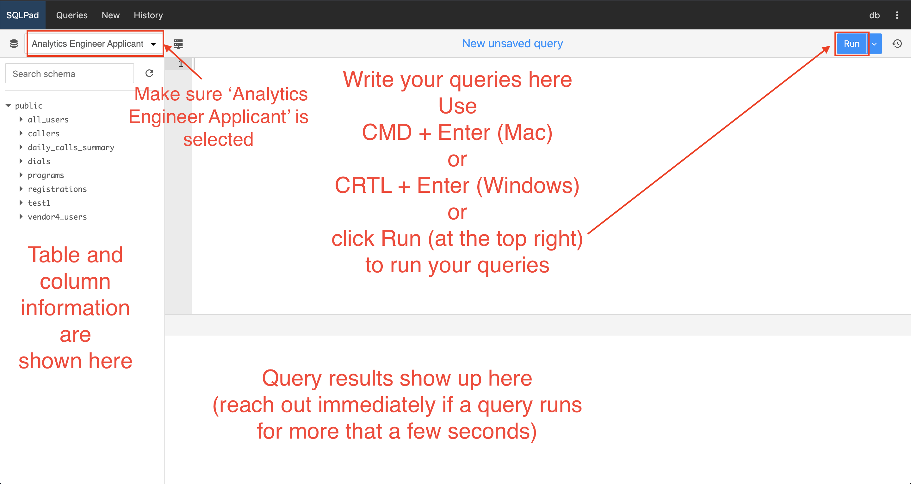

# SQL Queries

Target time: forty-five (45) minutes

## Context

We are trying to standardize and analyze various parts of our program. Given the
tables below, write queries to respond to the following tasks.

1. We are trying to insert vendor4's data into our `all_users` table. Write a
   _select_ query that returns the stadardized data that could be inserted into
   the `all_users` table.
2. Write a query using the `registrations` table that returns the total number
   of registrations(`total`), the number of completed registrations
   (`completed_registrations`) and the number of valid registrations that are
   incomplete (`valid_incomplete_registrations`), by organization and state.
3. Write a query (using the `callers`, `dialers`, `programs` tables) that
   returns the `program_name`, `program_date`, `caller_name` and number of calls
   made (`num_calls`). Use `'autodialer'` as the name for calls without a
   caller.

## Setup

We have set up a sandbox database and have created a unique user for you to use.
Visit http://45.55.61.152/ and log in using your email address and the last four
digits of your phone number. Once logged in, select **Analytics Engineer
Applicant** as the connection (near the top left).

_Before you get started, verify you can access it and reach out immediately if
you have any issues connecting or querying._

## Data

_**NOTE:** all data is randomly generated._

### all_users

| column            | type           | description                   |
| ----------------- | -------------- | ----------------------------- |
| id                | `varchar(210)` | The user's id                 |
| first_name        | `varchar(50)`  | The user's first name         |
| last_name         | `varchar(50)`  | The user's last name          |
| phone_number      | `bigint`       | The user's phone number       |
| zip_code          | `varchar(5)`   | The user's home zip code      |
| month_registerted | `varchar(15)`  | The month the user registered |

### vendor4_users

| column                | type           | description                                  |
| --------------------- | -------------- | -------------------------------------------- |
| last_first_name       | `varchar(110)` | The user's name (`'last_name, firs_name'`)   |
| email                 | `varchar(100)` | The user's email                             |
| phone                 | `varchar(18)`  | The user's phone number                      |
| zip_code              | `varchar(10)`  | The user's zip code                          |
| reg_date              | `timestamp`    | The date the user regisered                  |
| is_valid_registration | `bool`         | A flag for whether the registration is valid |
| email_opt_in          | `bool`         | A flag for the user's email opt in status    |
| phone_opt_in          | `bool`         | A flag for the user's email opt in status    |

### registrations

| column                   | type          | description                                                  |
| ------------------------ | ------------- | ------------------------------------------------------------ |
| file_id                  | `varchar(36)` | The id for the registration file                             |
| org                      | `varchar(50)` | The name of the organization that collected the registration |
| state                    | `varchar(2)`  | The state in which the organization runs its program         |
| is_complete_registration | `bool`        | A flag for whether the registration is complete              |
| is_valid_registration    | `bool`        | A flag for whether the registration is valid                 |
| reg_date                 | `timestamp`   | The date the registration was collected                      |

### callers

| column   | type           | description            |
| -------- | -------------- | ---------------------- |
| id       | `varchar(32)`  | The caller's id        |
| name     | `varchar(100)` | The caller's full name |
| username | `varchar(50)`  | The caller's username  |

### dials

| column              | type           | description               |
| ------------------- | -------------- | ------------------------- |
| caller_id           | `varchar(32)`  | The caller's id           |
| program_id          | `varchar(32)`  | The program's id          |
| registrant_id       | `varchar(36)`  | The registrant's id       |
| registrant_name     | `varchar(100)` | The registrant's name     |
| registrant_phone    | `varchar(12)`  | The registrant's phone    |
| registrant_response | `varchar(15)`  | The registrant's response |

### programs

| column | type          | description        |
| ------ | ------------- | ------------------ |
| id     | `varchar(32)` | The program's id   |
| name   | `varchar(50)` | The program's name |
| date   | `timestamp`   | The program's date |

## Deliverables

1. queries.sql

## Tips

- Add comments to the query code describing your thought process

dierent vendors and each one gave us the data in a dierent format. The task is to combine the data and prepare it to be loaded into our data warehouse. We anticipate that we will continue running this program long term. Therefore, consider that it would be included as part of a larger pipeline.
You may use any programming language you’re comfortable with - our preference, in order, is Python, R, other. In the README you sumbit, make sure to add a section about how to run the script. If you are short on time, you may write pseudo code for a script that would accomplish this task.
